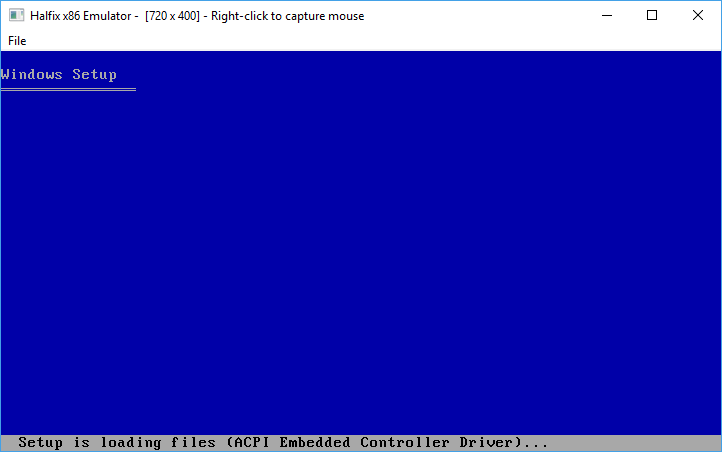

# Halfix x86 emulator

Halfix is a portable x86 emulator originally written in C99, but this fork was ported to C++20. It allows you to run legacy operating systems on modern platforms.

## Why?

This fork is used to test [lib86cpu](https://github.com/ergo720/lib86cpu), a cpu dynamic recompiler library.

## Building

This fork is focused only on Windows compatibility for now. You will need a C++20 compatible compiler, zlib, cmake and Visual Studio 2022. Only 64 bit builds are supported.

1. `cd` to the directory of halfix
2. `mkdir build && cd build`
3. `cmake .. -G "Visual Studio 17 2022" -A x64 -Thost=x64`
4. Build the resulting solution file halfix.sln with Visual Studio

## System Specifications

 - [CPU](https://github.com/nepx/halfix/tree/master/src/cpu): x86-32
 - RAM: Configurable - anywhere from 1 MB to 3584 MB
 - Devices:
   - Intel 8259 [Programmable Interrupt Controller](https://github.com/nepx/halfix/blob/master/src/hardware/pic.c)
   - Intel 8254 [Programmable Interval Timer](https://github.com/nepx/halfix/blob/master/src/hardware/pit.c)
   - Intel 8237 [Direct Memory Access Controller](https://github.com/nepx/halfix/blob/master/src/hardware/dma.c)
   - Intel 8042 ["PS/2" Controller](https://github.com/nepx/halfix/blob/master/src/hardware/kbd.c) with attached keyboard and mouse
   - [i440FX chipset](https://github.com/nepx/halfix/blob/master/src/hardware/pci.c) (this doesn't work quite so well yet)
     - 82441FX PMC
     - 82371SB ISA-to-PCI bus
     - 82371SB IDE controller
     - [ACPI](https://github.com/nepx/halfix/blob/master/src/hardware/acpi.c) interface
   - Intel 82093AA [I/O APIC](https://github.com/nepx/halfix/blob/master/src/hardware/ioapic.c)
 - Display: Generic [VGA graphics card](https://github.com/nepx/halfix/blob/master/src/hardware/vga.c) (ET4000-compatible) with Bochs VBE extensions, optionally PCI-enabled
 - Mass Storage: 
   - Generic [IDE controller](https://github.com/nepx/halfix/blob/master/src/hardware/ide.c) (hard drive and CD-ROM) 
   - Intel 82077AA [Floppy drive controller](https://github.com/nepx/halfix/blob/master/src/hardware/fdc.c) (incomplete, but works in most cases)
 - Dummy PC speaker (no sound)

## Compatibility

Currently, when used with the Boch's BIOS and the LGPL'ed VGA BIOS, it can boot the Windows XP installation CD up to the point where Windows tries to set up the FPU.

## Screenshots



## Transferring Files

Create a directory with all the files you want to transfer and create an ISO image. 

```
mkisofs -o programs.iso -max-iso9660-filenames -iso-level 4 programs/
```

Now update the configuration file as follows:

```
# Note: it does not hae to be ata0-slave. 
# I have not tested it with anything but ata0-slave.
[ata0-slave]
inserted=1
type=cd
file=/tmp/programs.iso
driver=sync
```

Now boot up your operating system and copy the files from the CD-ROM to the hard drive. 

## License

GNU General Public License version 3

## Similar Projects

 - [v86](https://www.github.com/copy/v86)
 - [JSLinux](http://bellard.org/jslinux/)
 - [jemul8](http://www.github.com/asmblah/jemul8)
